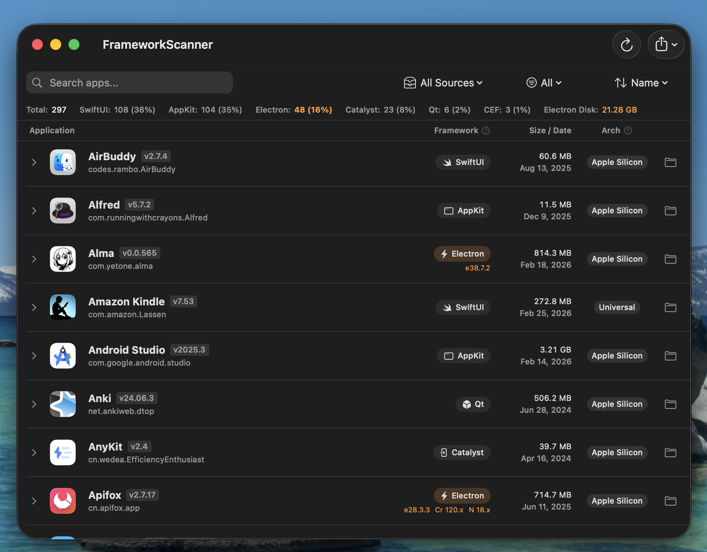
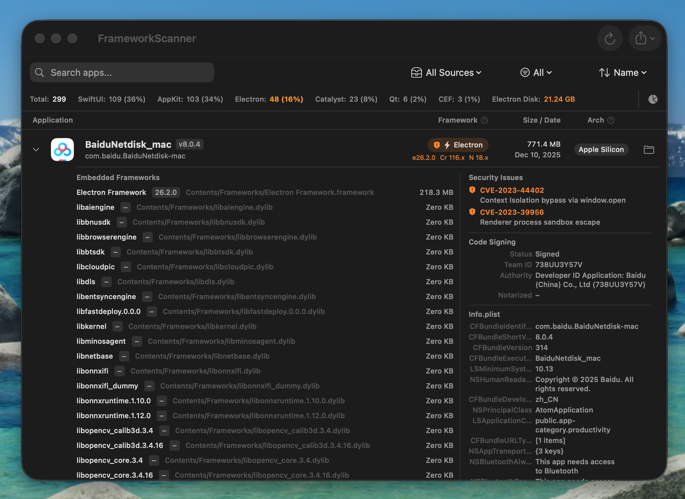

# FrameworkScanner

A macOS app that scans installed applications and identifies the development frameworks they use — Electron, SwiftUI, Flutter, Qt, Unity, and more.

 






## Features

- Scans `/Applications` and `~/Applications` with up to 8 concurrent tasks
- Detects 17 framework types: Electron, CEF, Flutter, Qt, Unity, Unreal Engine, .NET/MAUI, Java/JVM, Tauri, Catalyst, SwiftUI, AppKit, Python, Go/Wails, React Native, Capacitor, and Unknown
- Electron apps show Electron / Chromium / Node.js version details
- Security analysis: flags Electron apps with known CVEs (color-coded by severity)
- Expandable rows reveal embedded frameworks, code signing info, and Info.plist details
- Search, multi-filter, and sort by name / size / date / framework
- Stats bar with a Charts button — opens a window with pie chart, bar chart, and disk usage chart
- Export results as CSV or JSON
- Light / Dark / System appearance, 8 languages supported

## Requirements

- macOS 13.0 (Ventura) or later

## Installation

### Homebrew (Recommended)

```bash
brew tap Geoion/tap
brew install --cask frameworkscanner
```

After installation, if macOS Gatekeeper blocks the app on first launch, run:

```bash
xattr -cr /Applications/FrameworkScanner.app
```

> **Why is this needed?**
> macOS automatically adds a `com.apple.quarantine` extended attribute to files downloaded from the internet. This causes Gatekeeper to block unsigned or ad-hoc signed apps. The command above removes that attribute so the app can launch normally.

Then open the app as usual.

### Build from Source

Requires Xcode 15+ and [XcodeGen](https://github.com/yonaskolb/XcodeGen).

```bash
git clone https://github.com/Geoion/FrameworkScanner.git
cd FrameworkScanner
xcodegen generate
open FrameworkScanner.xcodeproj
```

## Usage

1. Launch **FrameworkScanner**
2. Click **Grant Access** and select your `/Applications` folder when prompted
3. The app scans all `.app` bundles and displays results in a sortable list
4. Click any row to expand and view embedded frameworks
5. Use the search bar and filter menu to narrow results
6. Use the **Export** button to save results as CSV or JSON

## Security Rules Maintenance

Electron CVEs are intentionally hardcoded. The app stores rule metadata (`version`, `last reviewed date`, `reminder threshold`) and shows a reminder when rules are stale.

Use this script to update the metadata in `Sources/Services/SecurityAnalyzer.swift`:

```bash
scripts/update_security_rules.sh
```

Common examples:

```bash
scripts/update_security_rules.sh --date 2026-03-15 --version 2026.03.15 --stamp-cves
scripts/update_security_rules.sh --threshold 21
```

## Changelog

### v1.1.1

- **i18n fix**: Complete localization for all 8 languages — Japanese, Korean, German, Spanish, Italian, and Russian translations were missing for the new keys added in v1.1.0 (security analysis, code signing detail, and charts)

### v1.1.0

- **New frameworks**: Added detection for Python (PyInstaller), Go/Wails, React Native macOS, and Capacitor (now 17 framework types)
- **Security analysis**: Electron apps with known CVEs are flagged with a shield icon, color-coded by severity (critical / high / medium / low)
- **Charts window**: Click the chart button in the stats bar to open a dedicated window with a pie chart, bar chart, and disk usage chart (requires macOS 14+)
- **Expanded detail drawer**: Expanding an app row now shows code signing status (authority, Team ID, notarization), key Info.plist fields, and security issues alongside the embedded framework list

### v1.0.0

- Initial release

## License

MIT
